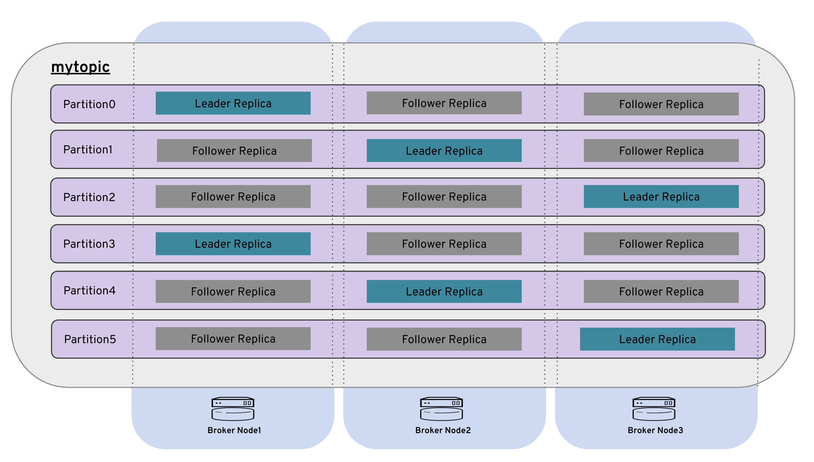

# 演習4. Topic の作成


## broker1 へのログイン {#login}

VM broker1 へログインします。

```bash
$ vagrant ssh broker1
```

## kafka ユーザーにスイッチ {#switch}

ユーザー `kafka` へスイッチします。

```bash
$ su - kafka
Password:
```

## Topic の作成 {#topic}
以下の Topic を作成してみます。

| topic | partitions | replication-factor |
|:--|:-- |:--|
|mytopic|3|6|

```bash
$ /opt/kafka/bin/kafka-topics.sh \
    --create \
    --topic mytopic \
    --partitions 3 \
    --replication-factor 6 \
    --zookeeper 192.168.33.11:2181
```
```bash
Error while executing topic command : Replication factor: 6 larger than available brokers: 3.
[2020-02-13 07:05:56,286] ERROR org.apache.kafka.common.errors.InvalidReplicationFactorException: Replication factor: 6 larger than available brokers: 3.
(kafka.admin.TopicCommand$)
```
> [!WARNING]
> 本 Hands-On では Kafka Broker の数は broker1、broker2、broker3 の計3台のため、replication-factors に 3 より大きい数値を指定することはできません。上記の通りエラーとなります。

<br>
replication-factors に 3 を設定しなおして Topic を作成します。

| topic | partitions | replication-factor |
|:--|:-- |:--|
|mytopic|6|3|

```bash
$ /opt/kafka/bin/kafka-topics.sh  --create --topic mytopic --partitions 6 --replication-factor 3 --zookeeper 192.168.33.11:2181
```
```bash
Created topic mytopic.
```

## Topic の表示 {#listtopic}

作成した Topic を一覧表示します。

```bash
$ /opt/kafka/bin/kafka-topics.sh --list --zookeeper 192.168.33.11:2181
```
```bash
mytopic
```


## Topic の状態を確認 {#topicstatus}

`--describe` を指定して `kafka-topic.sh` を実行することで Topic の詳細を確認することができます。

```bash
$ /opt/kafka/bin/kafka-topics.sh --describe --topic mytopic --zookeeper 192.168.33.11:2181
```
```bash
Topic:mytopic	PartitionCount:6	ReplicationFactor:3	Configs:
    Topic: mytopic	Partition: 0	Leader: 0	Replicas: 0,2,1	Isr: 0,2,1
    Topic: mytopic	Partition: 1	Leader: 1	Replicas: 1,0,2	Isr: 1,0,2
    Topic: mytopic	Partition: 2	Leader: 2	Replicas: 2,1,0	Isr: 2,1,0
    Topic: mytopic	Partition: 3	Leader: 0	Replicas: 0,1,2	Isr: 0,1,2
    Topic: mytopic	Partition: 4	Leader: 1	Replicas: 1,2,0	Isr: 1,2,0
    Topic: mytopic	Partition: 5	Leader: 2	Replicas: 2,0,1	Isr: 2,0,1
```



> [!NOTE] 
> 必ずしも上記の通りにリーダーが選出されるとは限りません。
> Isr は In-Sync Replica の略でリーダーレプリカの複製に追いついている Replica のことを挿します。この段階では Topic を作成しただけなのですべてのレプリカがリーダーに追いついている状態。


これで Topic の作成は終了です。