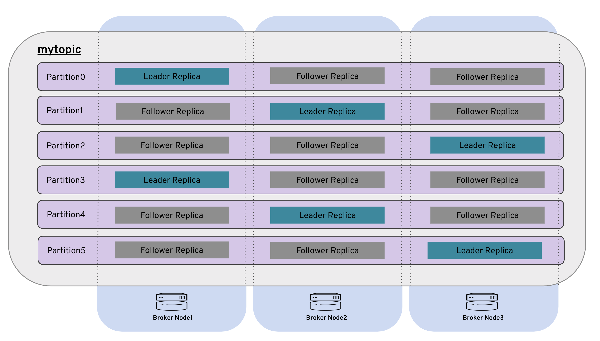

# 演習5. Producer と Consumer の起動

## Producer の起動 {#producer}

演習4 で作成した mytopic を使用します。
`/opt/kafka/bin/kafka-console-producer.sh` を使用して topic に値を格納します。
```bash
$ /opt/kafka/bin/kafka-console-producer.sh --broker-list 192.168.33.11:9092,192.168.33.12:9092,192.168.33.13:9092 --topic mytopic 
```
message1 ~ message9 まで値を格納し、`contrl + c` コマンドで終了します。
```bash
>message1
>message2
>message3
>message4
>message5
>message6
>message7
>message8
>message9
>^C
```

## Consumer の起動 {#consumer}
`/opt/kafka/bin/kafka-console-consumer.sh` を使用して topic から値を取り出します。
```bash
$ /opt/kafka/bin/kafka-console-consumer.sh --bootstrap-server 192.168.33.11:9092 --from-beginning --topic mytopic 
```
値が取り出せたら `control + c` コマンドで終了します。
```bash
message2
message8
message5
message4
message1
message7
message3
message9
message6
^C
```
> [!WARNING]
> Producer がメッセージを格納した順番と Consumer がメッセージを取り出した順番が異なります。
> 異なる Partition に格納されたメッセージは取り出す際には順序が保証されません。
> 
> どの Partition にどのメッセージが格納されたのか次のステップで Log を確認してみましょう。

## Log の確認 {#log}

`/var/lib/kafka` を `ls -l` コマンドで確認します。
```bash
$ ls -l /var/lib/kafka
```
```bash
// 略
drwxrwxr-x. 2 kafka kafka 141 Feb 13 04:43 __consumer_offsets-47
drwxrwxr-x. 2 kafka kafka 141 Feb 13 04:43 __consumer_offsets-5
drwxrwxr-x. 2 kafka kafka 141 Feb 13 04:43 __consumer_offsets-8
-rw-rw-r--. 1 kafka kafka   4 Feb 13 06:51 log-start-offset-checkpoint
-rw-rw-r--. 1 kafka kafka  54 Feb 13 00:15 meta.properties
drwxrwxr-x. 2 kafka kafka 141 Feb 13 06:48 mytopic-0
drwxrwxr-x. 2 kafka kafka 141 Feb 13 06:45 mytopic-1
drwxrwxr-x. 2 kafka kafka 141 Feb 13 06:48 mytopic-2
drwxrwxr-x. 2 kafka kafka 141 Feb 13 06:48 mytopic-3
drwxrwxr-x. 2 kafka kafka 141 Feb 13 06:45 mytopic-4
drwxrwxr-x. 2 kafka kafka 141 Feb 13 06:48 mytopic-5
-rw-rw-r--. 1 kafka kafka 458 Feb 13 06:51 recovery-point-offset-checkpoint
-rw-rw-r--. 1 kafka kafka 458 Feb 13 06:52 replication-offset-checkpoint
```

上記のとおり、Partition ごとにディレクトリが作成され(mytopic-0 〜 mytopic-5)、その下にバイナリ形式でメッセージが格納されています。

パーティション0 のログの中身を確認してみます。
```bash
$ od -c /var/lib/kafka/mytopic-0/00000000000000000000.log 
```
```bash
0000000  \0  \0  \0  \0  \0  \0  \0  \0  \0  \0  \0   @  \0  \0  \0  \0
0000020 002 205 221 377   U  \0  \0  \0  \0  \0  \0  \0  \0 001   p   =
0000040   N 222   B  \0  \0 001   p   =   N 222   B 377 377 377 377 377
0000060 377 377 377 377 377 377 377 377 377  \0  \0  \0 001 034  \0  \0
0000100  \0 001 020   m   e   s   s   a   g   e   1  \0  \0  \0  \0  \0
0000120  \0  \0  \0 001  \0  \0  \0   @  \0  \0  \0  \0 002 377 021 363
0000140   q  \0  \0  \0  \0  \0  \0  \0  \0 001   p   =   N 302 001  \0
0000160  \0 001   p   =   N 302 001 377 377 377 377 377 377 377 377 377
0000200 377 377 377 377 377  \0  \0  \0 001 034  \0  \0  \0 001 020   m
0000220   e   s   s   a   g   e   7  \0
0000230
```

> [!NOTE]
>  この例では message1 と message7 の文字列を確認できます。message1 と message7 は同一 Partition に格納されています。
> 他の Log も同様に確認してみましょう。

# Topic の再作成 {#topic}

## mytopic の削除

mytopic を削除します。
```bash
$ /opt/kafka/bin/kafka-topics.sh --delete --topic mytopic --zookeeper 192.168.33.11:2181
```
```bash
Topic mytopic is marked for deletion.
Note: This will have no impact if delete.topic.enable is not set to true.
```
> [!TIP] デフォルトでは Topic は削除できないようになっています。Hands-On 環境では気軽に Topic を削除できるよう、`/opt/kafka/config/server.properties` に `delete.topic.enable=true` を設定して削除可能にしてあります。

## mytopic の再作成

mytopic を以下の条件で再作成します。

| topic | partitions | replication-factor |
|:--|:-- |:--|
|mytopic|1|3|

```bash
$ /opt/kafka/bin/kafka-topics.sh --create --topic mytopic --partitions 1 --replication-factor 3 --zookeeper 192.168.33.11:2181
```
```bash
Created topic mytopic.
```

## mytopic の状態

mytopic の状態を表示します。
```bash
$ /opt/kafka/bin/kafka-topics.sh --describe --topic mytopic --zookeeper 192.168.33.11:2181
```
```bash
Topic:mytopic	PartitionCount:1	ReplicationFactor:3	Configs:
    Topic: mytopic	Partition: 0	Leader: 2	Replicas: 2,0,1	Isr: 2,0,1
```
Parttition が 0 だけになったことがわかります。


## 順序の確認 {#order}

### Producer
Producer を使用して topic に値を格納します。

```bash
$ /opt/kafka/bin/kafka-console-producer.sh --broker-list 192.168.33.11:9092,192.168.33.12:9092,192.168.33.13:9092 --topic mytopic 
```
```bash
>message1
>message2
>message3
>message4
>message5
>message6
>message7
>message8
>^C
```

### Consumer 

Consumer を使用して topic から値を取り出します。
```bash
$ /opt/kafka/bin/kafka-console-consumer.sh --bootstrap-server 192.168.33.11:9092 --from-beginning --topic mytopic 
```
```bash
message1
message2
message3
message4
message5
message6
message7
message8
^C
```
> [!NOTE] Partition が一つのケースでは割りあてられる Consumer も唯一つになるため並列処理が走らずメッセージの順序が保証されることがわかります。

### Partition の確認

`ls -l /var/lib/kafka` で Partition を確認します。
```bash
$ ls -l /var/lib/kafka
```
```bash
// 略
drwxrwxr-x. 2 kafka kafka 141 Feb 13 04:43 __consumer_offsets-8
-rw-rw-r--. 1 kafka kafka   4 Feb 13 07:17 log-start-offset-checkpoint
-rw-rw-r--. 1 kafka kafka  54 Feb 13 00:15 meta.properties
drwxrwxr-x. 2 kafka kafka 141 Feb 13 07:16 mytopic-0
-rw-rw-r--. 1 kafka kafka 398 Feb 13 07:17 recovery-point-offset-checkpoint
-rw-rw-r--. 1 kafka kafka 398 Feb 13 07:17 replication-offset-checkpoint
```

> [!NOTE]先ほどと異なり mytopic-0 のひとつだけのディレクトリが生成されています。

`od` コマンドで Log ファイルの中身を確認してみます。

```bash
$ od -c /var/lib/kafka/mytopic-0/00000000000000000000.log 
```
```bash
0000000  \0  \0  \0  \0  \0  \0  \0  \0  \0  \0  \0   @  \0  \0  \0  \0
0000020 002   ~   R 275 373  \0  \0  \0  \0  \0  \0  \0  \0 001   p   =
0000040   h   [ 215  \0  \0 001   p   =   h   [ 215 377 377 377 377 377
0000060 377 377 377 377 377 377 377 377 377  \0  \0  \0 001 034  \0  \0
0000100  \0 001 020   m   e   s   s   a   g   e   1  \0  \0  \0  \0  \0
0000120  \0  \0  \0 001  \0  \0  \0   @  \0  \0  \0  \0 002 361 311 233
0000140   5  \0  \0  \0  \0  \0  \0  \0  \0 001   p   =   h   b 272  \0
0000160  \0 001   p   =   h   b 272 377 377 377 377 377 377 377 377 377
0000200 377 377 377 377 377  \0  \0  \0 001 034  \0  \0  \0 001 020   m
0000220   e   s   s   a   g   e   2  \0  \0  \0  \0  \0  \0  \0  \0 002
0000240  \0  \0  \0   @  \0  \0  \0  \0 002   j 326   _   j  \0  \0  \0
0000260  \0  \0  \0  \0  \0 001   p   =   h   i 325  \0  \0 001   p   =
0000300   h   i 325 377 377 377 377 377 377 377 377 377 377 377 377 377
0000320 377  \0  \0  \0 001 034  \0  \0  \0 001 020   m   e   s   s   a
0000340   g   e   3  \0  \0  \0  \0  \0  \0  \0  \0 003  \0  \0  \0   @
0000360  \0  \0  \0  \0 002   9 332 221 317  \0  \0  \0  \0  \0  \0  \0
0000400  \0 001   p   =   h   p 374  \0  \0 001   p   =   h   p 374 377
0000420 377 377 377 377 377 377 377 377 377 377 377 377 377  \0  \0  \0
0000440 001 034  \0  \0  \0 001 020   m   e   s   s   a   g   e   4  \0
0000460  \0  \0  \0  \0  \0  \0  \0 004  \0  \0  \0   @  \0  \0  \0  \0
0000500 002  \r  \b   w 037  \0  \0  \0  \0  \0  \0  \0  \0 001   p   =
0000520   h   w 321  \0  \0 001   p   =   h   w 321 377 377 377 377 377
0000540 377 377 377 377 377 377 377 377 377  \0  \0  \0 001 034  \0  \0
0000560  \0 001 020   m   e   s   s   a   g   e   5  \0  \0  \0  \0  \0
0000600  \0  \0  \0 005  \0  \0  \0   @  \0  \0  \0  \0 002   D 224   D
0000620 261  \0  \0  \0  \0  \0  \0  \0  \0 001   p   =   h 200   *  \0
0000640  \0 001   p   =   h 200   * 377 377 377 377 377 377 377 377 377
0000660 377 377 377 377 377  \0  \0  \0 001 034  \0  \0  \0 001 020   m
0000700   e   s   s   a   g   e   6  \0  \0  \0  \0  \0  \0  \0  \0 006
0000720  \0  \0  \0   @  \0  \0  \0  \0 002 006 210   Z 311  \0  \0  \0
0000740  \0  \0  \0  \0  \0 001   p   =   h 207 317  \0  \0 001   p   =
0000760   h 207 317 377 377 377 377 377 377 377 377 377 377 377 377 377
0001000 377  \0  \0  \0 001 034  \0  \0  \0 001 020   m   e   s   s   a
0001020   g   e   7  \0  \0  \0  \0  \0  \0  \0  \0  \a  \0  \0  \0   @
0001040  \0  \0  \0  \0 002 320 210   @ 365  \0  \0  \0  \0  \0  \0  \0
0001060  \0 001   p   =   h 216   o  \0  \0 001   p   =   h 216   o 377
0001100 377 377 377 377 377 377 377 377 377 377 377 377 377  \0  \0  \0
0001120 001 034  \0  \0  \0 001 020   m   e   s   s   a   g   e   8  \0
0001140
```

> [!NOTE] message1 〜 message8 まですべてのメッセージが一つの Partition 内に格納されていることがわかります。

以上で Producer と Consumer の起動は終了です。