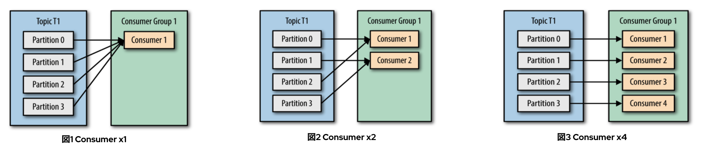
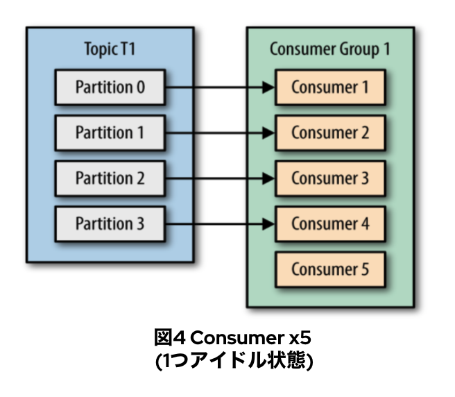
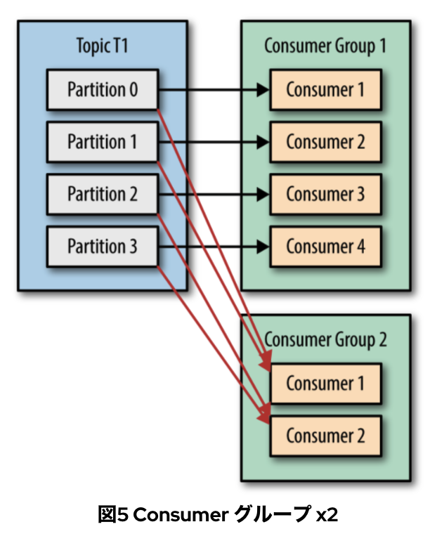

# 演習6. Producer と Consumer の開発


Producer と Consumer のクライアントを開発していきます。

今回の演習で使うためのトピックを、最初に準備しておきます。Partitionを4つに変更した`mytopic`を用意し、このトピックに対して開発する Producer と Consumer を使って、メッセージの送受信を行います。

```bash
$ /opt/kafka/bin/kafka-topics.sh --alter --topic mytopic --partitions 4 --bootstrap-server 192.168.33.11:2181
```

## Producer の開発 {#producer}

以下のコマンドを実行して Kafka Producer のソースコードを clone します。

```bash
$ git clone https://github.com/k-kosugi/kafka-hands-on
```

### Producer のコード確認 

ダウンロードしたレポジトリの、[/producer/src/main/java/com/redhat/japan/kafka/producer](https://github.com/k-kosugi/kafka-hands-on/tree/master/producer/src/main/java/com/redhat/japan/kafka/producer) ディレクトリにProducerのコードが保存されています。今回は、IDEから実行していきますので、お使いのIDEからダウンロードしたProducerのファイルを閲覧してみてください。

*Producer.java*
```java
package com.redhat.japan.kafka.client;

import java.time.LocalDateTime;
import java.util.Properties;
import java.util.concurrent.ExecutionException;
import java.util.concurrent.Future;
import java.util.stream.Stream;

import org.apache.kafka.clients.producer.ProducerConfig;
import org.apache.kafka.clients.producer.ProducerRecord;
import org.apache.kafka.clients.producer.KafkaProducer;
import org.apache.kafka.clients.producer.RecordMetadata;

public class Producer {

    public static void main(String[] args) {

        // Properties の生成
        Properties properties = new Properties();

        // Kafka Broker の設定
        properties.setProperty(ProducerConfig.BOOTSTRAP_SERVERS_CONFIG, "192.168.33.11:9092");

        // StringSerializer の設定
        properties.setProperty(ProducerConfig.KEY_SERIALIZER_CLASS_CONFIG, "org.apache.kafka.common.serialization.StringSerializer");
        properties.setProperty(ProducerConfig.VALUE_SERIALIZER_CLASS_CONFIG, "org.apache.kafka.common.serialization.StringSerializer");

        // KafkaProducer の生成
        KafkaProducer<String, String> producer = new KafkaProducer<>(properties);

        // 同期送信
        Stream.of("message1", "message2", "message3", "message4", "mesasge5", "message6", "mesasge7", "message8")
                .forEach(i -> {
                    try {
                        // Record の生成(キーなしでレコードを生成)
                        // 第一引数は topic 名
                        // 第二引数は メッセージ
                        ProducerRecord<String, String> records = new ProducerRecord<>("testtopic", i);
                        Future<RecordMetadata> future = producer.send(records);
                        RecordMetadata recordMetadata = future.get();

                        System.out.println("=====================================================");
                        System.out.println(LocalDateTime.now());
                        System.out.println("      value : " + i);
                        System.out.println("  partition : " + recordMetadata.partition());
                        System.out.println("     offset : " + recordMetadata.offset());

                        Thread.sleep(2000);
                    } catch (InterruptedException e) {
                        e.printStackTrace();
                    } catch (ExecutionException e) {
                        e.printStackTrace();
                    }
                });

    }

}

```

### Producer のコード実行

IDE、または.jarファイルを作成してコマンドラインから実行します。実行すると以下のようなログが出力されます。

```
=====================================================
2021-08-15T10:00:44.633
      value : message1
  partition : 0
     offset : 0
=====================================================
2021-08-15T10:00:46.649
      value : message2
  partition : 3
     offset : 0
=====================================================
2021-08-15T10:00:48.900
      value : message3
  partition : 2
     offset : 0
=====================================================
2021-08-15T10:00:50.992
      value : message4
  partition : 1
     offset : 0
=====================================================
2021-08-15T10:00:53
      value : message5
  partition : 0
     offset : 1
=====================================================
2021-08-15T10:00:55.009
      value : message6
  partition : 3
     offset : 1
=====================================================
2021-08-15T10:00:57.021
      value : message7
  partition : 2
     offset : 1
=====================================================
2021-08-15T10:00:59.031
      value : message8
  partition : 1
     offset : 1
```

このログから `partition :` がローテーションされていることがわかります。これはProducerによるパーティションの割り当てが行われていてます。KafkaではまずProducerがBrokerにどのようにパーティションを割り当てるかを決定します。 割り当てられた後は、offsetの番号は通常通りインクリメントされていきます。

| No. | メッセージ | パーティション |
|:--|:--|:--|
| 1 |message1|partition: 0|
| 2 |message2|partition: 3|
| 3 |message3|partition: 2|
| 4 |message4|partition: 1|
| 5 |message5|partition: 0|
| 6 |message6|partition: 3|
| 7 |message7|partition: 2|
| 8 |message8|partition: 1|

Producerクライアントによるパーティションの割り当て方法は、キーの値がない場合は、ラウンドロビンでのメッセージ送信となります。その他、Producer クライアントから、以下のような方法でメッセージを送信することができます。

> [!NOTE]
> キーの値がある場合は、デフォルトではキーのハッシュを生成して、それを特定のパーティションに割り当てます。


## Consumer の開発 {#consumer}

それでは`mytopic`へ８つのmessageを送付しましたので、Consumerクライアントを使ってメッセージの受信をしていきます。

### Consumer のコード確認
本演習の初回でダウンロードしたレポジトリの、[/consumer/src/main/java/com/redhat/japan/kafka/consumer](https://github.com/k-kosugi/kafka-hands-on/tree/master/consumer/src/main/java/com/redhat/japan/kafka/consumer) ディレクトリにConsumerのコードを保存しています。

Kafka Consumerは、ConsumerとConsumerグループで構成されています。ConsumerはConsumerグループに属していて、各Consumerは購読するトピックのパーティションを担当しています。

万が一Consumerが障害でシャットダウンなどに止まった場合にも、グループ内のConsumer同士で担当するパーティションのオーナーシップを引き継ぐことができるため、可用性を持つことができます。この仕組みがリバランスと言われています。



図１や図２のようにConsumerを増やすことで購読するトピックのパーティションを共有することができます。トピックのメッセージの消費をスケールするためには、パーティションと同数のConsumerを持つことになります。図３は４つのConsumerにそれぞれ一つのパーティションが割り当てられている例です。

ここでは図３のようにそれぞれのパーティションに割り当てがされている、Consumer、Consumerグループを開発していきます。Consumerをマルチスレッドで作るため、複数スレッドとしてKafka Consumerを呼び出す[ConsumerGroup.java]()と、実際にConsumerタスクを生成する[ConsumerThread.java]()の二つを利用します。

*ConsumerGroup.java*
```java
package com.redhat.japan.kafka.consumer;

import org.apache.kafka.clients.consumer.ConsumerConfig;
import org.apache.kafka.clients.consumer.KafkaConsumer;

import java.util.ArrayList;
import java.util.Arrays;
import java.util.List;

import java.util.concurrent.ExecutorService;
import java.util.concurrent.Executors;
import java.util.stream.Stream;

public class ConsumerGroup {

    public static void main(String[] args) {

        String consumerGroupName = "groupid";
        String topic = "mytopic";
        String[] consumerList = {"Consumer1", "Consumer2", "Consumer3", "Consumer4"};
        int numConsumers = consumerList.length;
        ExecutorService executor = Executors.newFixedThreadPool(numConsumers);

        // 同期送信
        Stream.of(consumerList)
                .forEach(consumer -> {
                    ConsumerThread consumerThread = new ConsumerThread(consumer,consumerGroupName,topic);
                    executor.submit(consumerThread);
                });
    }
}

```


*ConsumerThread.java*
```java
package com.redhat.japan.kafka.consumer;

import org.apache.kafka.clients.consumer.ConsumerConfig;
import org.apache.kafka.clients.consumer.ConsumerRecords;
import org.apache.kafka.clients.consumer.KafkaConsumer;

import java.time.Duration;
import java.util.Collections;
import java.util.Properties;
import java.util.concurrent.atomic.AtomicBoolean;

public class ConsumerThread implements Runnable {

    private final AtomicBoolean closed = new AtomicBoolean(false);

    private KafkaConsumer<String, String> kafkaConsumer;
    private String consumerGroupName;
    private String consumerName;
    private String topic;

    public ConsumerThread(String consumerName, String consumerGroupName, String topic) {

        this.consumerName = consumerName;
        this.consumerGroupName = consumerGroupName;
        this.topic = topic;

        // プロパティの生成と設定
        Properties properties = new Properties();
        properties.setProperty(ConsumerConfig.BOOTSTRAP_SERVERS_CONFIG, "192.168.33.11:9092");
        properties.setProperty(ConsumerConfig.GROUP_ID_CONFIG, consumerGroupName);
        properties.setProperty(ConsumerConfig.KEY_DESERIALIZER_CLASS_CONFIG, "org.apache.kafka.common.serialization.StringDeserializer");
        properties.setProperty(ConsumerConfig.VALUE_DESERIALIZER_CLASS_CONFIG, "org.apache.kafka.common.serialization.StringDeserializer");

        // Consumer の生成
        this.kafkaConsumer = new KafkaConsumer<>(properties);
    }

    public void run() {
        // スレッドを トピック に割り当てる
        kafkaConsumer.subscribe(Collections.singletonList(topic));
        try {
            while (!closed.get()) {
                // polling
                ConsumerRecords<String, String> consumerRecord = kafkaConsumer.poll(Duration.ofMillis(1_000));

                consumerRecord.forEach(record -> {
                    System.out.println("group: " + consumerGroupName +
                            ", consumer: " + consumerName +
                            ", partition: " + record.partition() +
                            ", topic: " + record.topic() +
                            ", offset: " + record.offset() +
                            ", key: " + record.key() +
                            ", value: " + record.value()
                    );
                });
            }
        } catch (Exception e) {
            if (!closed.get()) {
                throw e;
            }
        } finally {
            kafkaConsumer.close();
        }

    }
}
```

### Consumer のコード実行 
IDEまたは.jarファイルから実行します。

*ConsumerGroup.javaの結果*
```
group: groupid, consumer: Consumer1, partition: 0, topic: mytopic, offset: 2, key: null, value: message1
group: groupid, consumer: Consumer4, partition: 3, topic: mytopic, offset: 2, key: null, value: message2
group: groupid, consumer: Consumer3, partition: 2, topic: mytopic, offset: 2, key: null, value: message3
group: groupid, consumer: Consumer2, partition: 1, topic: mytopic, offset: 2, key: null, value: message4
group: groupid, consumer: Consumer1, partition: 0, topic: mytopic, offset: 3, key: null, value: message5
group: groupid, consumer: Consumer4, partition: 3, topic: mytopic, offset: 3, key: null, value: message6
group: groupid, consumer: Consumer3, partition: 2, topic: mytopic, offset: 3, key: null, value: message7
group: groupid, consumer: Consumer2, partition: 1, topic: mytopic, offset: 3, key: null, value: message8

```

Consumer1にはパーティションが以下のように割り当てられており、トピックの持つ４つのパーティションにそれぞれConsumerが割り当てられていることがわかります。

| No. | Consumer | パーティション |
|:--:|:--:|:--:|
| 1 |Consumer1|partition: 0|
| 2 |Consumer2|partition: 3|
| 3 |Consumer3|partition: 2|
| 4 |Consumer4|partition: 1|

## パーティション以上のConsumer のケース {#multiconsumers}
それでは、パーティション以上のConsumerが生成された場合も見ておきましょう。

<div style="text-align: center"></div>

Kafka Consumerでは、トピックのパーティション数以上にConsumerを追加してもパーティションはアサインされません。余ったConsumerはアイドル状態になるため、ちゃんとパーティション数を確認の上、Consumer数は設計することが必要です。

*ConsumerGroupWithFiveCons.java*
```java

import java.util.concurrent.ExecutorService;
import java.util.concurrent.Executors;
import java.util.stream.Stream;

public class ConsumerGroupWithFiveCons {

    public static void main(String[] args) {

        String consumerGroupName = "groupid";
        String topic = "mytopic";

        // Consumerの数を5つに増やしました
        String[] consumerList = {"Consumer1", "Consumer2", "Consumer3", "Consumer4", "Consumer5"};
        int numConsumers = consumerList.length;
        ExecutorService executor = Executors.newFixedThreadPool(numConsumers);

        // 同期送信
        Stream.of(consumerList)
                .forEach(consumer -> {
                    ConsumerThread consumerThread = new ConsumerThread(consumer,consumerGroupName,topic);
                    executor.submit(consumerThread);
                });
    }
}
```

実際に実行してみましょう。同様に、IDEまたは.jarファイルから実行します。

*ConsumerGroupWithFiveCons.javaの結果*
```
group: groupid, consumer: Consumer4, partition: 3, topic: mytopic, offset: 8, key: null, value: message1
group: groupid, consumer: Consumer3, partition: 2, topic: mytopic, offset: 8, key: null, value: message2
group: groupid, consumer: Consumer2, partition: 1, topic: mytopic, offset: 8, key: null, value: message3
group: groupid, consumer: Consumer1, partition: 0, topic: mytopic, offset: 8, key: null, value: message4
group: groupid, consumer: Consumer4, partition: 3, topic: mytopic, offset: 9, key: null, value: messasge5
group: groupid, consumer: Consumer3, partition: 2, topic: mytopic, offset: 9, key: null, value: message6
group: groupid, consumer: Consumer2, partition: 1, topic: mytopic, offset: 9, key: null, value: messasge7
group: groupid, consumer: Consumer1, partition: 0, topic: mytopic, offset: 9, key: null, value: message8
```

結果の中には、Consumer5が一度も登場してきていません。

| No. | Consumer | パーティション |
|:--:|:--:|:--:|
| 1 |Consumer1|partition: 0|
| 2 |Consumer2|partition: 1|
| 3 |Consumer3|partition: 2|
| 4 |Consumer4|partition: 3|
| 5 |Consumer5|割り当てなし|

このように、パーティション数以上のConsumerを追加しても、パーティションよりもConsumerの方が多い場合には、メッセージを受け取ってくれないConsumerが出てきしまいますので、避けましょう。

## Consumerグループ追加 のケース {#consumergroups}
最後は別のConsumerグループを追加したケースを試していきます。AMQ Stream(Apache Kafka) では、メッセージを消費するアプリケーションが増えた場合にも柔軟に対応するができます。

<div style="text-align: center"></div>


ここでは異なるConsumerグループを作成する、AnotherConsumerGroup.javaを利用して実際に動かしてみます。


*AnotherConsumerGroup.java*
```java

import java.util.concurrent.ExecutorService;
import java.util.concurrent.Executors;
import java.util.stream.Stream;

public class AnotherConsumerGroup {

    public static void main(String[] args) {

        String consumerGroupName = "anothergroupid";
        String topic = "mytopic";

        // Consumerの数を5つに増やしました
        String[] consumerList = {"AnotherConsumer1", "AnotherConsumer2"};
        int numConsumers = consumerList.length;
        ExecutorService executor = Executors.newFixedThreadPool(numConsumers);

        // 同期送信
        Stream.of(consumerList)
                .forEach(consumer -> {
                    ConsumerThread consumerThread = new ConsumerThread(consumer,consumerGroupName,topic);
                    executor.submit(consumerThread);
                });
    }
}
```

こちらも実際に実行してみましょう。同様に、IDEまたは.jarファイルから実行します。


*ConsumerGroup.javaの結果*
```
group: groupid, consumer: Consumer3, partition: 2, topic: mytopic, offset: 10, key: null, value: message1
group: groupid, consumer: Consumer2, partition: 1, topic: mytopic, offset: 10, key: null, value: message2
group: groupid, consumer: Consumer1, partition: 0, topic: mytopic, offset: 10, key: null, value: message3
group: groupid, consumer: Consumer4, partition: 3, topic: mytopic, offset: 10, key: null, value: message4
group: groupid, consumer: Consumer3, partition: 2, topic: mytopic, offset: 11, key: null, value: messasge5
group: groupid, consumer: Consumer2, partition: 1, topic: mytopic, offset: 11, key: null, value: message6
group: groupid, consumer: Consumer1, partition: 0, topic: mytopic, offset: 11, key: null, value: messasge7
group: groupid, consumer: Consumer4, partition: 3, topic: mytopic, offset: 11, key: null, value: message8
```

AnotherConsumerGroup.javaの結果
```
group: anothergroupid, consumer: Consumer2, partition: 2, topic: mytopic, offset: 10, key: null, value: message1
group: anothergroupid, consumer: Consumer1, partition: 1, topic: mytopic, offset: 10, key: null, value: message2
group: anothergroupid, consumer: Consumer1, partition: 0, topic: mytopic, offset: 10, key: null, value: message3
group: anothergroupid, consumer: Consumer2, partition: 3, topic: mytopic, offset: 10, key: null, value: message4
group: anothergroupid, consumer: Consumer2, partition: 2, topic: mytopic, offset: 11, key: null, value: messasge5
group: anothergroupid, consumer: Consumer1, partition: 1, topic: mytopic, offset: 11, key: null, value: message6
group: anothergroupid, consumer: Consumer1, partition: 0, topic: mytopic, offset: 11, key: null, value: messasge7
group: anothergroupid, consumer: Consumer2, partition: 3, topic: mytopic, offset: 11, key: null, value: message8
```

二つのConsumerグループを異なるグループIDで実行することで、同じトピックのパーティションからメッセージを読み出していることがわかります。

| No. | パーティション | ConsumerグループID:<br>groupid | ConsumerグループID:<br>anothergroupid |
|:--:|:--:|:--:|:--:|
| 1 |partition: 0|Consumer1|Consumer1|
| 2 |partition: 1|Consumer2|Consumer1|
| 3 |partition: 2|Consumer3|Consumer2|
| 4 |partition: 3|Consumer4|Consumer2|


以上で Producer と Consumer の開発 は終了です。

