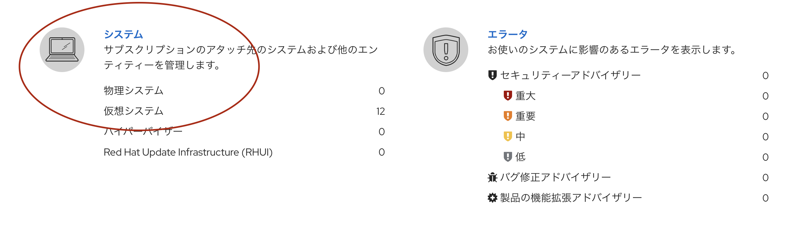
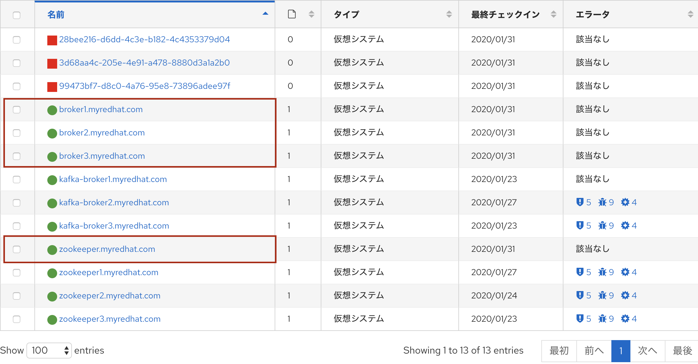

# Hands-On 環境の構築

本環境は Vagrant + VirtualBox を利用して構築します。
作成する VM は計 4 台ですが、ハンズオン環境のスペックに応じて 2 台にすることも可能です。

1. Ansible 用 VM (CentOS 7)
1. Kafka Broker1 & Zookeeper 用 VM (Red Hat Enterprise Linux 8)
1. Kafka Broker2 (Red Hat Enterprise Linux 8)
1. Kafka Broker3 (Red Hat Enterprise Linux 8)

## 事前準備

### Vagrant のインストール
- https://www.vagrantup.com/

### VirtualBox のインストール
- https://www.virtualbox.org/

## Hands-On 環境の構築

### Git Hub からコンテンツのダウンロード

各ハンズオンマシンにログインして `git clone` もしくは zip で Vagrantfile やその他ファイルをダウンロードします。
```bash
TODO
$ git clone https://.....
```

### RHEL のサブスクリプションの設定

`kafka-hands-on/vm/inventory.txt` を編集して、最終行の2行を書き換えます。
```bash
$ vi kafka-hands-on/vagrant/inventory.txt
```
```bash
[all:vars]
user=kkosugi
password=""
```

> [!NOTE]
> Red Hat Employee Subscription を持ったユーザーのユーザー名とパスワードを記載します。
> - 作成した RHEL8 のサブスクリプションを登録するのに利用します。
> - OpenJDK 11 や unzip コマンドなどをインストールする際に必要になります。

### AMQ Streams のダウンロード

AMQ Streams をダウンロードして、`kafka-hands-on/vagrant/amq-streams-1.3.0-bin.zip`として配置します。

### Vagrant の起動

`kafka-hands-on/vm` に移動して、`vagrant up` コマンドを実行します。
Vagrant の RHEL8 のイメージをダウンロードし、4台の VM の作成が開始されます。イメージのダウンロードや VM 作成には時間がかかります。

```bash
$ vagrant up
```
以下のログが出力されたら環境構築完了です。
```bash
// 略
    ansible: 
    ansible: TASK [Reload firewalld process.] ***********************************************
    ansible: changed: [broker3.myredhat.com]
    ansible: changed: [broker1.myredhat.com]
    ansible: changed: [broker2.myredhat.com]
    ansible: 
    ansible: PLAY RECAP *********************************************************************
    ansible: broker1.myredhat.com       : ok=6    changed=5    unreachable=0    failed=0    skipped=8    rescued=0    ignored=0   
    ansible: broker2.myredhat.com       : ok=14   changed=13   unreachable=0    failed=0    skipped=0    rescued=0    ignored=0   
    ansible: broker3.myredhat.com       : ok=14   changed=13   unreachable=0    failed=0    skipped=0    rescued=0    ignored=0  
```

# Hands-On 環境の削除

## VM の削除
`vagrant destroy` コマンドを実行して各 VM を削除します。

```bash
$ vagrant destroy -f
```

## サブスクリプションの削除

[Red Hat サブスクリプション管理](https://access.redhat.com/management)にログインして、紐づけられたマシンを削除します。


